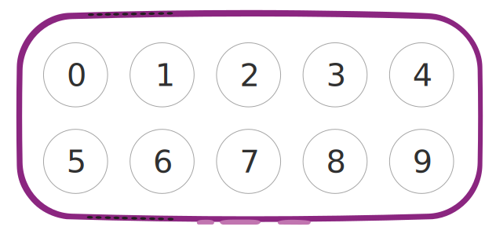
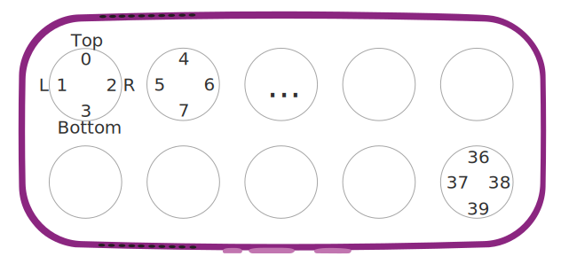

Each buttton on Boppo is ordered from 0 to 9, with the top row (furtherst from the power button) being buttons 0-4 and the bottom row being buttons 5-9.

Each button has 4 lights. Lights are ordered top, left, right, then bottom with each button's lights followed by the next.

