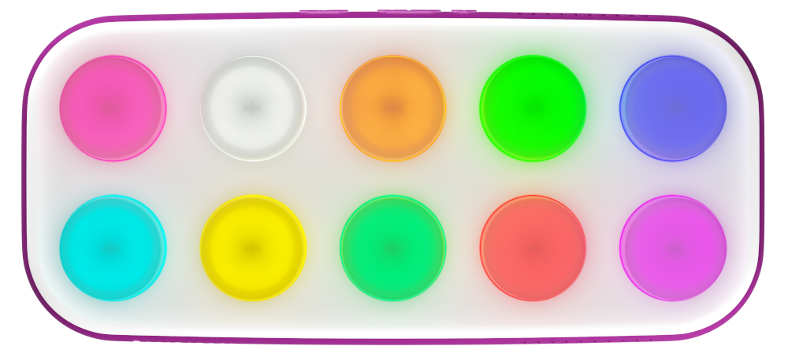

# Boppo Developer Docs

[Boppo](https://boppo.com) is a programmable screen-free tablet with 10 light-up mechanical keyboard buttons, a speaker, RFID reader, SD card and ESP32-S3 micro-controller.

Boppo ships with over 40 included activities with more coming regularly.

Boppo is an expandable platform to build activities, interactive content, and games. The following APIs are available or being worked on:

* [WASM API](/docs/wasm) for programmable activities that execute on the tablet
* [WebSocket API](/docs/websocket) for programmable activities that execute from a computer over the network
* [HTTPS Server API](/docs/https-api) for remote control of the tablet (e.g. adjusting volume level, starting activites...)
<!--* [File Formats for Built-in Activities](/docs/built-in-activities) allow for customizing activities (e.g. custom sound effects...)-->

You can also customize your Boppo using the [phone app](https://boppo.com/phone-app) including uploading your own music and audio books and changing the various settings.
